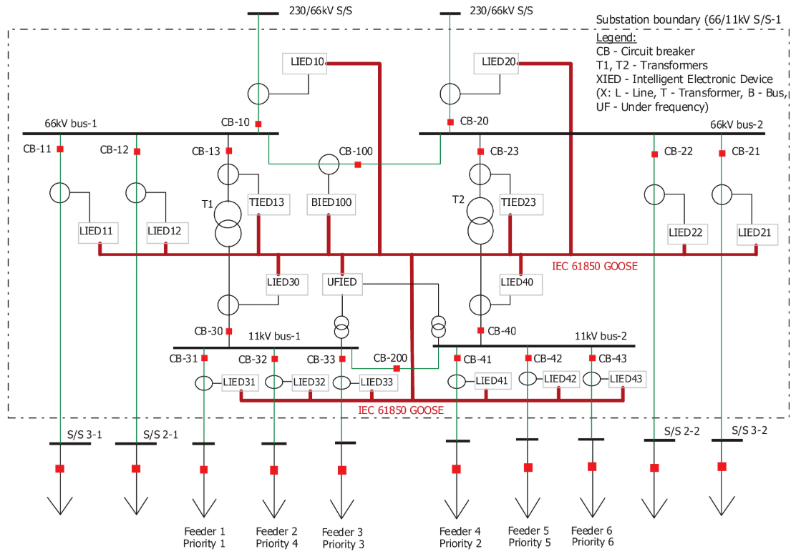

# IEC61850SecurityDataset
This repository contains network traces that describe GOOSE communications in a substation. The reference one-diagram used for generating the network traces is shown in Figure 1. It consists of 4-buses, and 18 LEDs. The line feeders (1-6) are connected to different loads while the rest of the feeders connect to other nearby substations to provide redundancy. The IEDs communicate among themselves using the GOOSE protocol defined in the IEC 61850 standard. Based on the substation diagram, we consider three scenarios to generate the network traces

**1. Normal Scenario**

**2. Disturbance Scenario**

We consider 3 representative disturbance scenarios(,  and ) under which substation protection system operates. 
*Busbar protection* 

Let us consider that a fault occurs at busbar 66kV bus-1. The incomer line LIED10 will pick up on overcurrent, the other IEDs wont.
The incomer line LIED10 will know through GOOSE communication that the overcurrent elements of other IEDs have not picked up.
The incomer line LIED10 will quickly realise of busbar fault and trigger a trip to its own breaker CB-10 first and subsequently to the breakers associated with the busbars i.e., CB-11, CB-12 and CB-13.
The trip status of CB-10 is sent by LIED10 through GOOSE communication to LIED11, LIED12 and TIED13 to trigger trip for their respective breakers.

*Breaker failure protection*
*Underfrequencey load-shedding*

**3. Attack Scenario**

Each folder represents one scenario, it contains： 
	
	1. One pcap file: captures GOOSE packets from 18 IEDs during 10 mins. 
	
	2. 18 csv files: list transmitted data from 18 IEDs at every second during 10 mins.

But the attacking scenario is based on normal scenario's trasmission traffic, so there is no specific CSV in Attack folder.
